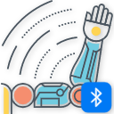
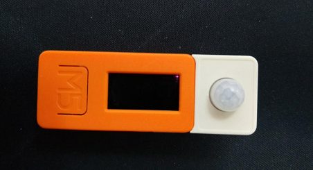
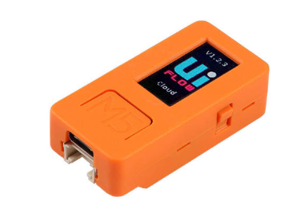
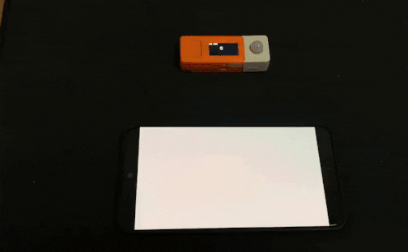

BLE-PirSensor

## 项目介绍


一个简单的人体感应门铃系统,使用M5StickC、人体红外传感器（AS312）开发，通过BLE和手机连接，当检测到人体时，手机APP进行闪屏提示。

## 硬件


[M5StickC](https://docs.m5stack.com/#/en/core/m5stickc) 是一款基于esp32,可用来进行IoT开发的硬件，非常小巧。可使用[Arduino](https://www.arduino.cc/)和[UIFlow](http://flow.m5stack.com/)进行程序开发。


## 软件
#### 代码分为两部分
#### 1.Arduino部分代码（C++）[APK Download](https://github.com/VincentTung/BLE-PirSensor/raw/master/apk/app-release.apk)

```cpp

/**
 * 
 * init ble
 * 
 * */
void initBLE(){
  BLEDevice::init(DEVICE_NAME);
  BLEServer *pServer = BLEDevice::createServer();
  BLEService *pService = pServer->createService(SERVICE_UUID);
  pCharacteristic = pService->createCharacteristic(
                                         CHARACTERISTIC_UUID,
                                         BLECharacteristic::PROPERTY_NOTIFY
                                       );
  //set default value                                     
  pCharacteristic->setValue("0");  
  //start service                              
  pService->start();

  BLEAdvertising *pAdvertising = pServer->getAdvertising();
  pAdvertising->start();


}

void setup() {
  M5.begin();
  M5.Lcd.setRotation(3);
  M5.Lcd.fillScreen(BLACK);
  M5.Lcd.println("PIR TEST");

  pinMode(36,INPUT_PULLUP);
  initBLE();
}
void closeLED(){
  pinMode(10, OUTPUT);
  digitalWrite(10, HIGH);
}

void openLED(){
  pinMode(10, OUTPUT);
  digitalWrite(10, LOW);
}
void loop() {
  M5.Lcd.setCursor(60, 20, 4);
  int signal = digitalRead(36);
  M5.Lcd.println(signal);

  if(signal ==1){ 
    itoa(signal, str, 10);
    pCharacteristic->setValue(str);
    pCharacteristic->notify();
  }
  delay(TIME_INTERVAL);
}

```
#### 2.Android App 部分代码(kotlin)
```kotlin
  /**
     * 连接设备
     */
    private fun connectDevice(device: BluetoothDevice) {
        device.connectGatt(this, true, object : BluetoothGattCallback() {

            override fun onConnectionStateChange(gatt: BluetoothGatt?, status: Int, newState: Int) {
                super.onConnectionStateChange(gatt, status, newState)
                runOnUiThread {
                    when (newState) {
                        BluetoothProfile.STATE_CONNECTED -> {
                            showToast(R.string.connected)
                            gatt?.discoverServices()?.let { started ->
                                if (started) {
                                    showToast(R.string.discover_services)
                                }
                            }

                        }
                        BluetoothProfile.STATE_DISCONNECTED -> showToast(R.string.disconnected)
                        BluetoothProfile.STATE_CONNECTING -> showToast(R.string.connecting)
                    }
                }
            }

            override fun onServicesDiscovered(gatt: BluetoothGatt?, status: Int) {
                super.onServicesDiscovered(gatt, status)

                gatt?.services?.let { services ->
                    services.forEach { service ->
                        if (service.uuid.toString() == PIR_SERVICE_UUID) {
                            checkCharacteristic(gatt, service)
                        }
                    }
                }
            }

            override fun onCharacteristicChanged(gatt: BluetoothGatt?, characteristic: BluetoothGattCharacteristic?) {
                super.onCharacteristicChanged(gatt, characteristic)
                val value = characteristic?.value?.toString(Charsets.UTF_8)
                value?.let {
                    if (it == BLINK_VALUE) {
                        runOnUiThread {
                            blinkScreen()
                        }
                    }
                }
            }
        })
    }

    /**
     * 接收通知
     */
    private fun checkCharacteristic(gatt: BluetoothGatt, service: BluetoothGattService?) {

        service?.characteristics?.forEach { characteristic ->
            if (characteristic.properties and BluetoothGattCharacteristic.PROPERTY_NOTIFY > 0 && characteristic.uuid.toString() == PIR_CHARACTERISTIC_UUID) {
                gatt.setCharacteristicNotification(characteristic, true)
                showToast(R.string.subscribe_success)
            }

        }


    }
```
## 演示

